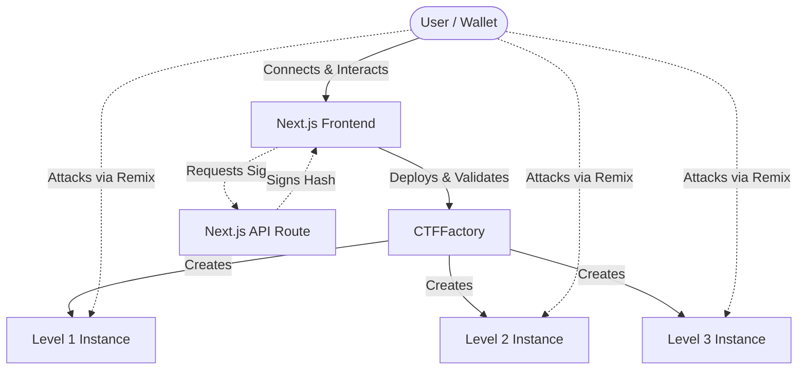

# HackTheChain
A sequential, on-chain Web3 Capture The Flag (CTF) engine designed to teach smart contract security vulnerabilities through interactive, dynamic challenges.

## Overview
HackTheChain is a Web3 security educational platform. It provides developers and security enthusiasts with a safe, local, and testnet-deployable environment to practice exploiting common smart contract vulnerabilities. Rather than just reading about exploits, users deploy real on-chain instances of vulnerable contracts, interact with them through a dedicated Next.js frontend, and attack them using tools like Remix or Foundry. 

By completing these challenges, users learn how vulnerabilities like Reentrancy, Oracle Manipulation, and Signature Replay occur in the wild, and how to protect against them.

## Features
- **Sequential Web3 CTF levels**: Progression system requiring players to solve levels in order.
- **Wallet-based interaction**: Connect and interact seamlessly using modern Web3 wallets.
- **On-chain challenge instances**: Every player gets their own isolated vulnerable contract instance deployed by a centralized factory.
- **Real Sepolia testnet interaction**: Fully functional on actual Ethereum testnets (or local forks).
- **Level completion/validation**: Cryptographic on-chain validation of challenge completion.
- **Soulbound badges**: ERC721 non-transferable NFTs awarded upon solving levels.
- **Token balances and vault state**: Live, dynamic display of MKT, TRC, and Vault balances directly in the UI.
- **Solidity source inspection**: Built-in, comment-stripped read-only source viewers for active challenges.
- **Backend signature generation**: A fully integrated Next.js API route that generates EIP-191 signatures for off-chain authorization testing.

## CTF Levels

### Level 1 — Reentrancy
- **Vulnerability**: Reentrancy (failure to follow Checks-Effects-Interactions).
- **What the player sees**: A vault holding 100 TRC tokens, a starter balance of 10 TRC, and a vulnerable `withdraw` function.
- **What the player needs to understand**: How the `onTRCReceived` fallback function can be used to re-enter a contract before its internal balances are updated.
- **Main contracts involved**: `Level1_Reentrancy.sol`, `TRACE.sol`.
- **Learning objective**: Understanding the CEI pattern and the dangers of untrusted external calls during token transfers.
- **Completion condition**: Drain the Level 1 vault completely.
- **High-level player workflow**: The player connects their wallet, deploys the instance, writes a malicious attacker contract in Remix to intercept the TRC transfer, and triggers the reentrancy loop to steal all vault funds.

### Level 2 — Oracle Manipulation
- **Vulnerability**: Spot price oracle manipulation on a low-liquidity AMM.
- **What the player sees**: A lending vault holding 100 TRC, an AMM with reserves of 10 MKT and 10 TRC, and a live Oracle price feed. The player starts with 10 MKT collateral and 40 TRC.
- **What the player needs to understand**: The vault relies on a spot AMM to calculate the value of MKT collateral. Swapping a large amount of TRC for MKT artificially inflates the perceived value of MKT in the same transaction.
- **Main contracts involved**: `Level2_OracleManipulation.sol`, `SimpleAMM.sol`, `VulnerableOracle.sol`, `MKT.sol`, `TRACE.sol`.
- **Learning objective**: Understanding the dangers of using thinly-traded spot AMMs as price oracles for lending protocols (a common DeFi exploit).
- **Completion condition**: Drain the Level 2 vault completely.
- **High-level player workflow**: The player inspects the AMM and Vault source, crafts an attacker contract that drastically skews the AMM reserves by swapping TRC for MKT, deposits their MKT collateral at an inflated valuation, borrows all TRC from the vault, and leaves the protocol with bad debt.

### Level 3 — Signature Replay
- **Vulnerability**: Missing nonce / used-signature tracking.
- **What the player sees**: A vault holding 100 TRC and a UI button to request a backend-generated authorization signature for withdrawing 10 TRC.
- **What the player needs to understand**: The backend generates a perfectly valid, cryptographically secure EIP-191 signature tying authorization to the exact vault, the player's address, and the amount (10 TRC). However, the smart contract never marks the signature as used.
- **Main contracts involved**: `Level3_SignatureReplay.sol`.
- **Learning objective**: Understanding that robust signature verification requires more than just correct cryptography; it requires replay protection (nonces or mapping states).
- **Completion condition**: Drain the Level 3 vault completely.
- **High-level player workflow**: The player requests a single valid signature from the frontend API. They then copy this signature to Remix, deploy an attacker contract, and call the vault's withdraw function repeatedly within a loop using the *same* signature until the vault is empty.

## Architecture


*Note: For Level 3, the backend API uses a trusted private key to sign a hash of `(vault, player, amount)` which the `Level3` contract verifies using OpenZeppelin's `ECDSA.recover`.*

## Tech Stack
- **Blockchain**: Ethereum (Sepolia Testnet)
- **Smart Contracts**: Solidity ^0.8.20
- **Contract Libraries**: OpenZeppelin Contracts v5.7.0
- **Frontend**: Next.js 16, React 19, Tailwind CSS v4
- **Web3 Libraries**: Wagmi, Viem, RainbowKit
- **Development/Testing**: Foundry (Forge)

## Smart Contracts
- **`CTFFactory.sol`**: The core orchestrator. Manages deployment of challenge instances, tracks player progression, and validates solutions.
- **`TRACE.sol` & `MKT.sol`**: Standard ERC20 tokens used as the underlying assets and collateral in the CTF ecosystem.
- **`Level1_Reentrancy.sol`**: A simple vault that updates internal balances *after* transferring tokens, allowing reentrancy.
- **`SimpleAMM.sol`**: A minimal Constant Product Market Maker (CPMM) facilitating trades between MKT and TRC.
- **`VulnerableOracle.sol`**: A price feed that naively reads the current spot reserves of `SimpleAMM.sol` to determine asset prices.
- **`Level2_OracleManipulation.sol`**: A lending protocol that relies on `VulnerableOracle.sol` to calculate collateral ratios.
- **`Level3_SignatureReplay.sol`**: A vault that securely verifies off-chain EIP-191 signatures but fails to track if a signature has been used previously.
- **`SoulboundBadge.sol`**: An ERC721 contract that mints non-transferable NFTs to players as proof of completion for each level.

## Frontend
The Next.js frontend serves as the player's primary interface to the CTF:
- **Main UI**: Displays active challenges, dynamic token balances (reading live on-chain data), and vault states.
- **Wallet Connection**: Integrated with RainbowKit/Wagmi for seamless interaction.
- **Level Progression**: Automatically unlocks subsequent levels as the factory confirms `isSolved` state on-chain.
- **Source Viewers**: Provides stripped-down, read-only Solidity source code for levels like Oracle Manipulation, forcing players to read code without hand-holding comments.
- **Signature UI**: For Level 3, provides a button to request a payload from the backend API, displaying the raw hex signature for copying into Remix.

## Backend
The Level 3 signature API is implemented as a Next.js App Router API endpoint (`/api/level3-signature`):
- **Input**: Expects JSON containing `instanceAddress`, `playerAddress`, and `amount`.
- **Validation**: Enforces the withdrawal amount is exactly 10 ether (10 TRC).
- **Signing**: Uses `viem/accounts` and the secure `LEVEL3_SIGNER_PRIVATE_KEY` to hash and sign the payload.
- **Output**: Returns the `v,r,s` Ethereum Signed Message (EIP-191) signature to the frontend.
The trusted signer's public address is injected into the `CTFFactory` during deployment, binding the smart contract to the backend's secure key.

## Deployment / How It Works
The project relies on Foundry for smart contract compilation and deployment.

1. Ensure dependencies are installed in the `contracts` directory.
2. Compile the contracts using `forge build`.
3. Set your environment variables in `contracts/.env`.
4. Run the deployment script `DeployCTF.s.sol` via `forge script` to deploy the `CTFFactory` to Sepolia.
5. Take the resulting `CTFFactory` address and update the frontend configuration (`config.ts`).
6. Start the Next.js development server to interact with the deployed factory.

## Running Locally

### 1. Smart Contract Setup
```bash
cd contracts
forge install
forge build
```

### 2. Environment Variables
Create a `.env` file in the `contracts` directory with the following variable names (do NOT share these publicly):
```env
PRIVATE_KEY=<your-deployer-private-key>
LEVEL3_SIGNER_PRIVATE_KEY=<your-level3-signer-private-key>
LEVEL3_TRUSTED_SIGNER=<public-address-derived-from-level3-signer-key>
SEPOLIA_RPC_URL=<your-sepolia-rpc-url>
```
*Note: The frontend symlinks `frontend/.env.local` to `contracts/.env` to share these keys securely with the Next.js backend API.*

### 3. Contract Deployment (Sepolia)
```bash
cd contracts
forge script script/DeployCTF.s.sol:DeployCTF --rpc-url $SEPOLIA_RPC_URL --broadcast
```
*After deployment, copy the `CTFFactory` address into `frontend/src/app/config.ts`.*

### 4. Frontend & Backend Setup
```bash
cd frontend
npm install
npm run dev
```
Open `http://localhost:3000` to view the CTF.

## Testing
The repository features comprehensive Foundry tests for all smart contracts.

To run tests:
```bash
cd contracts
forge test -vvv
```
Tests cover:
- Factory deployment logic
- Token minting and badge issuance
- Simulated end-to-end exploits of the Level 1 Reentrancy, Level 2 Oracle Manipulation, and Level 3 Signature Replay vulnerabilities.

## Security / Educational Disclaimer
**WARNING:** This repository intentionally contains highly vulnerable smart contracts designed exclusively for educational and CTF purposes. **DO NOT** use any of the smart contract patterns found in the `Level` contracts, `SimpleAMM`, or `VulnerableOracle` in production financial infrastructure. They are built specifically to be exploited.

## Project Structure
```text
HackTheChain/
├── contracts/
│   ├── script/
│   │   └── DeployCTF.s.sol
│   ├── src/
│   │   ├── CTFFactory.sol
│   │   ├── Level1_Reentrancy.sol
│   │   ├── Level2_OracleManipulation.sol
│   │   ├── Level3_SignatureReplay.sol
│   │   ├── MKT.sol
│   │   ├── SimpleAMM.sol
│   │   ├── SoulboundBadge.sol
│   │   ├── TRACE.sol
│   │   └── VulnerableOracle.sol
│   └── test/
│       ├── CTFFactory.t.sol
│       ├── Level1Reentrancy.t.sol
│       ├── Level2OracleManipulation.t.sol
│       └── Level3SignatureReplay.t.sol
├── frontend/
│   ├── src/
│   │   └── app/
│   │       ├── api/
│   │       │   └── level3-signature/
│   │       │       └── route.ts
│   │       ├── config.ts
│   │       ├── l2sources.ts
│   │       ├── l3sources.ts
│   │       ├── layout.tsx
│   │       ├── page.tsx
│   │       └── providers.tsx
│   └── package.json
└── README.md
```

## Learning Outcomes
By completing this CTF, players will learn:
- **Smart contract vulnerabilities**: Recognizing insecure design patterns.
- **Reentrancy**: Exploiting unsafe external calls and understanding the CEI pattern.
- **Oracle manipulation & AMM logic**: Understanding the dangers of using low-liquidity spot AMMs as price oracles, and how flash-loan-style swaps manipulate valuations.
- **Signature verification & Replay attacks**: Working with `ECDSA.recover`, EIP-191, and implementing stateful replay protection (nonces).
- **Wallet/testnet interaction**: Executing raw transactions and cross-contract calls using tools like Remix and Foundry against a real testnet environment.
- **Reading Solidity source**: Analyzing unstructured, comment-stripped contract code to identify attack vectors.

## License
No license is currently specified for this repository.